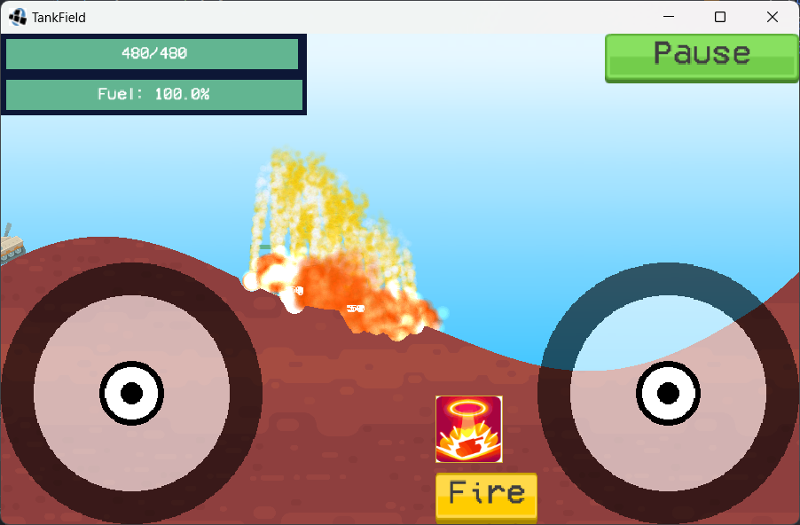

# Tank
> Check out <a href="https://zhyu.tk/Tank.html">the other page!</a>
> <h3><a href="https://zhyu.tk/Tank/index.html">Web</a></h3>
> <h3><a href="https://zhyu.tk/Tank/Tank%20Field.apk">Android</a></h3>
> <h3><a href="https://zhyu.tk/Tank/Tank%20Field.jar">Desktop</a></h3>
> Email me at <a href="mailto:zy@zhyu.tk">zy@zhyu.tk</a> if you found problems.

The above is the old description from 2019, innocent times.

This game is obviously inspired by Tank Stars, taking assets directly from the game as well.

I certainly hope that no legal action will be taken against me.

> To any authorities investigating this in any case, I do not bare any malicious intent, and is not attempting to infringe copyright of Tank Star, this was completed by a kid with no intention of monetising, distribution or whatsoever.

# The game

A simple version of tank side shooter with following features.

- Level selection
- Ammo selection
  - Many types of ammo! + special hidden ammo types!
  - Beautiful effects!
- Fuel barrels for strategic maneuvers
- Bomber planes
- PVP